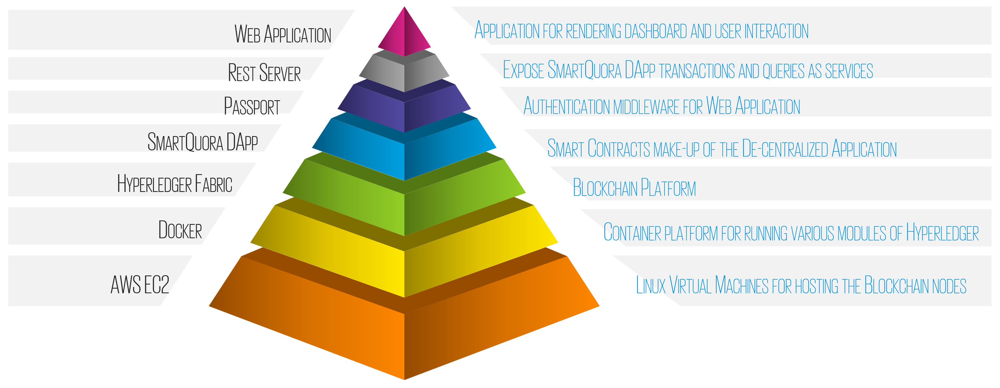
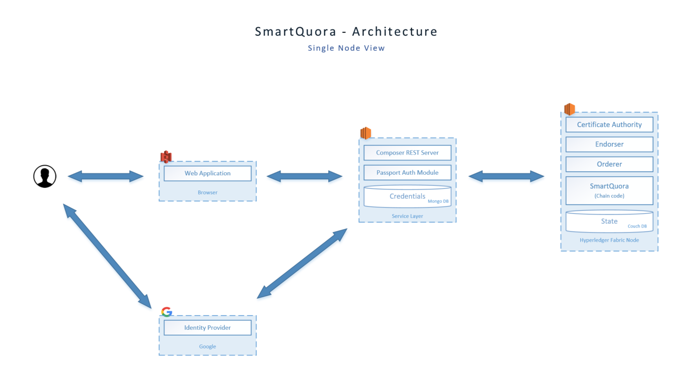
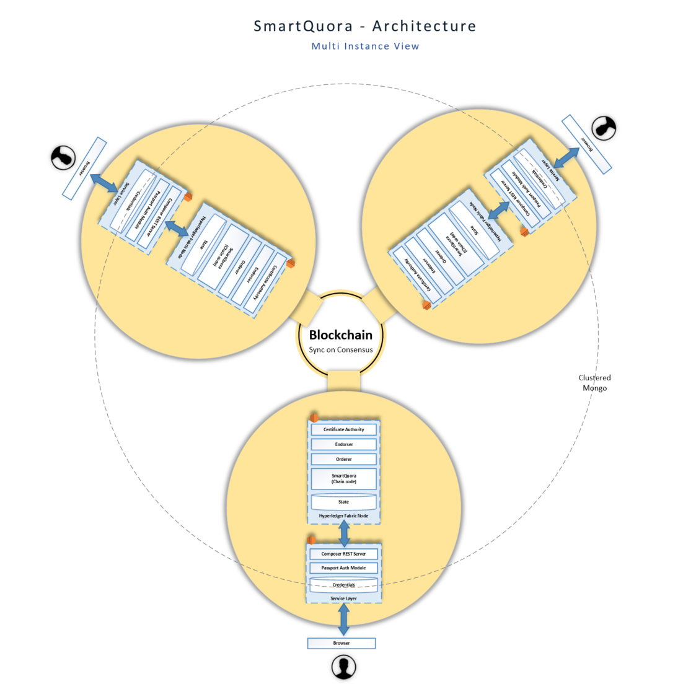
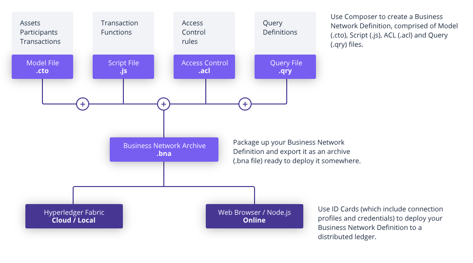
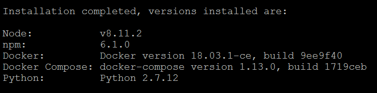
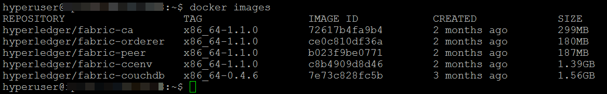
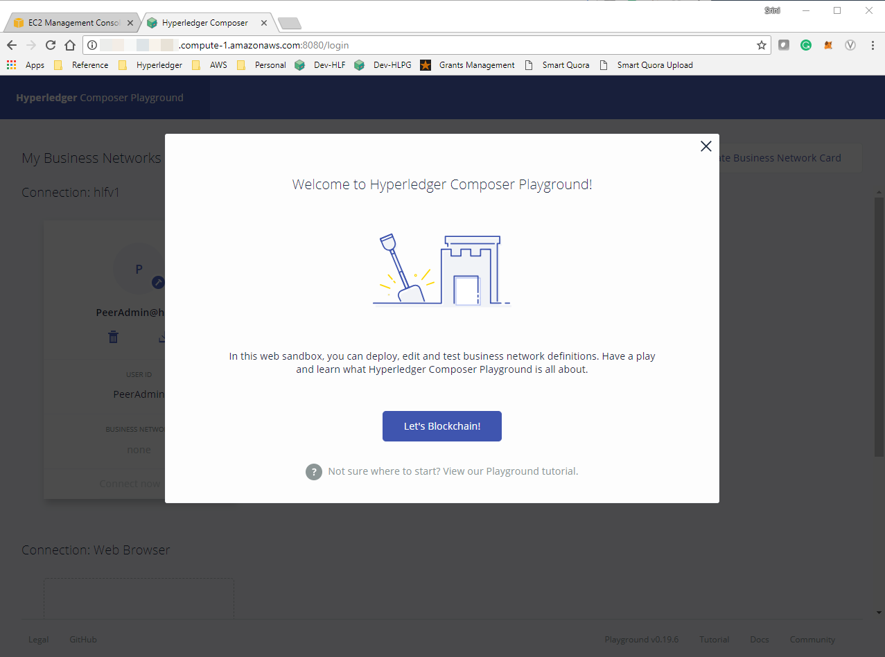
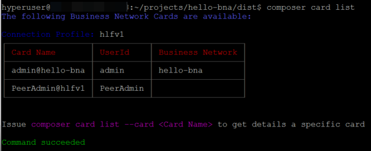
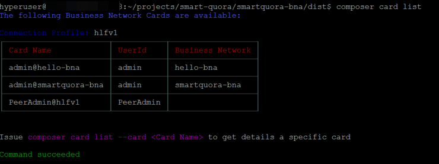

# SmartQuora

**SmartQuora** is an application that enables knowledge sharing among participants while incentivizing answers that are meaningful and well-explained. *Inquirers* pose questions with a reward for the best answers and a due-date by which they are looking for an answer. *Responders* compete with each other to provide the best answers. Participants can like or dislike answers. When the due-date arrives the answers are tallied and the reward is shared proportionately among the responders such that the best answers gets the most earnings.  To avoid abuse of the platform, inquirers cannot answer their own questions and respondents cannot vote for their own answers.

Technically speaking, SmartQuora is a *DApp* (Decentralized Application) built on top of the HLF - Hyperledger Fabric Blockchain decentralized peer-to-peer network. It uses Smart Contracts built using HLF Composer API to represent Questions and Answers which contains rules to manage the process and payout. 

SmartQuora uses a Javascript-based front-end web application to communicate withe the Blockchain platform on which the Smart Contracts reside using a RESTful interface. It uses Passport for authentication of participants using OAuth protocol and allows maintenance of their digital wallets through which the participants can manage their Digital Identities. These Digital Identities are generated and managed using the Hyperledger Fabric platform.

## Audience
You are a Developer or Solutions Architect wanting to learn and build robust, secure and scaleable decentralized applications using open source framework such as Hyperledger Fabric to take full advantage of the autonomy point that a blockchain protocol provides without a central point of failure.

As you are building this application, you will learn about the Hyperledger Fabric blockchain framework, Hyperledger Fabric Composer API, Passport authentication middleware, Docker containerization and various development scaffolding frameworks such as Yeoman, Loopback etc. discussed below.

## Architecture
The Hyperledger Fabric blockchain platform that SmartQuora uses for this demonstration is built on top of AWS EC2 platform. It uses Docker containers to host various parts of the Hyperledger Fabric components such as the endorser, committer, ledger  (store) , orderer (consensus service) and the chain-code.

The following diagram provides a high-level component diagram of the SmartQuora DApp. 



As such, the blockchain is a distributed system consisting of many nodes that communicate with each other. The blockchain runs programs called chaincode, which holds state and ledger data, and executes transactions. The chaincode is the central element as transactions are operations invoked on the chaincode. Transactions have to be “endorsed” and only endorsed transactions may be committed and have an effect on the state. 

### Storage
DApps such as SmartQuora consists of Smart Contracts that are translated to chaincode. This chaincode is then deployed into the blockchain. Storage of chaincode and state information differs across blockchain platforms. The default mechanism of persistent state storage in Hyperledger Fabric is LevelDB or CouchDB. In addition to supporting chaincode operations to store and retrieve assets, CouchDB allows performing complex rich queries against the data stored in the blockchain.

### Service Layer
Aside from storage, a DApp requires a service layer to communicate with the chaincode on the blockchain and a front-end for user interaction. SmartQuora takes advantage of the Hyperledger Composer REST server which uses Loopback to generate a REST server and maps it to the transactions and queries on the DApp.

### Authentication
SmartQuora DApp uses the OAuth authentication strategy of the [Passport](http://www.passportjs.org/) authentication middleware to secure the REST server. Specifically, it uses the [Passport Google OAuth](https://github.com/jaredhanson/passport-google-oauth#readme) delegated authentication strategy allowing users to authenticate themselves using their Google account.

All information regarding authenticated users and their wallets is persisted in a [LoopBack](http://loopback.io/) data source by using a LoopBack connector. By default, the REST server uses the LoopBack "memory" connector to persist user information, which is lost when the REST server is terminated. To enable persistent storage of the authenticated users and their wallets, SmartQuora uses a MongoDB LoopBack connector that stores data in a highly available MongoDB data source online at [mLab](https://mlab.com/). 

The following diagram depicts a single-node view of the SmartQuora DApp.


### Digital Identity & Wallets
Blockchain uses Digital Identities to represent participants in the network. A identity is a digital certificate and private key. These identities are used to sign transactions on behalf of the participants on the blockchain network. Identities are assembled in an envelope called _business network cards_ along with the metadata and connection profile of the participant in Hyperledger Fabric. These business cards are then stored in wallets. As such, a participant can have multiple business cards in their wallet.

### Nodes 
The decentralized nature of a blockchain platform is what gives it the power to tolerate system failures, record transactions that cannot be altered retroactively without the alteration of subsequent blocks and the collusion of the network. Decentralization or peer-to-peer network requires multiple nodes to be added to the blockchain network. These nodes are the communication entities of the blockchain. There are three types of nodes in the Hyperledger Fabric blockchain:

1.  **Client**  : The client represents the entity that acts on behalf of an end-user. It orchestrates data and transactions between peers.
2.  **Peer**: A peer receives ordered state updates in the form of _blocks_ from the ordering service and maintain the state and the ledger. Peers can additionally take up a special role of an  **endorser** which uses endorsement policies to sign the transactions. Once the client receives enough signatures to satisfy the endorsement policy, it can submit the transaction (and the signatures) to be added to the ledger.
3.  **Orderer**: The orderer provides a shared _communication channel_ to clients and peers, offering a broadcast service for messages containing transactions and implements a delivery guarantee.

For further details on the basic workflow of a transaction inside a Hyperledger Fabric blockchain please refer to this [document](http://hyperledger-fabric.readthedocs.io/en/release-1.1/arch-deep-dive.html#basic-workflow-of-transaction-endorsement).

The following diagram depicts the SmartQuora DApp when deployed on a multiple hosts to derive the benefits of the blockchain. For the sake of simplicity, in this tutorial, we will deploy the SmartQuora DApp as a logical instance on single host.


## DApps - Decentralized Applications
### Understanding Blockchain
Before we break-down a DApp it is essential to understand its underlying technology - the Blockchain. Blockchain is a continously growing digital ledger of records organized in _blocks_ that are linked together by cryptographic validation. The key is to understand that this ledger is neither stored in a centralized location nor managed by any single entity, hence its distributed-ness. The block validation system results in new transactions being added irreversibly and old transactions preserved forever for all to see, hence its transparency and resilience. Applications built on top of blockchain technology is called DApps. For an overview of blockchain and its underlying technologies, please review the following [whitepaper](https://medium.com/@skarlekar/blockchain-smart-contracts-demystified-4c239d879f4c). 
 
### Anatomy of the DApp (or BNA)
 In the world of Hyperledger Fabric, DApps are called BNA or Business Network Applications. We will use the Hyperledger Composer to model the SmartQuora BNA - Business Network Application.  Composer is an extensive, open development toolset and framework to make developing blockchain applications easier. Hence, I will use the term interchangeably throughout the rest of the documentation.


## SmartQuora Process Flow

## Setup Instructions
### Installing Hyperledger Fabric on AWS
#### Launch an EC2 Instance
For this exercise, we will deploy Hyperledger Fabric on a clean Ubuntu 16.04 LTS 64-bit environment on a AWS EC2 instance as per the configuration shown in the picture below. 
Make sure to open ports: 22, 80, 443, 8080-81 & 3000.

#### Associate an Elastic IP 
Allocate a new Elastic IP address and associate it with the newly created instance. This will help maintain sanity while working on the scripts between relaunches of the instance.
#### Create Hyperuser
Hyperledger Fabric installation prohibits using the root identity to install the software. Therefore, create a new user and add that user to the _sudo_ group. You can choose any user name. I am using _hyperuser_

    $ sudo adduser hyperuser
    $ sudo adduser hyperuser sudo

Switch user to hyperuser and add the current working directory "." to the PATH environment variable in .profile.

    su - hyperuser
    vi .profile
    PATH=".:$HOME/bin:$HOME/.local/bin:$PATH"

**Note**: Always use _su -_ to switch user going forward to enable the environment variables are sourced from your _.profile_

**Note**: While this section goes over the installation of HLF on a compute instance on AWS EC2, the installation can be done on a compute instance on any public cloud such as Microsoft Azure, Google Cloud, IBM Bluemix or your own virtual machine on your local desktop/laptop.

#### Install the Hyperledger Fabric Pre-requisites
Use the following commands or follow the [installing pre-requisites guide](https://hyperledger.github.io/composer/latest/installing/installing-prereqs.html#ubuntu) to prep the environment for Hyperledger Fabric installation.
```bash
curl -O https://hyperledger.github.io/composer/latest/prereqs-ubuntu.sh

chmod u+x prereqs-ubuntu.sh
```
Next run the script to install the pre-requisites.
```
./prereqs-ubuntu.sh
```
After the installation is complete you should see a message stating that the following components are installed:

1. node
2. npm
3. docker
4. python



At this point remember to log out and log back in to ensure you have access to the newly deployed binaries.

Verify that you have access to the binaries installed as follows:

    docker -v
    npm -v
    node -v
    python
    
#### Install the Hyperledger Development Environment
Follow the instructions below or use the [HLF Development Tools installation guide](https://hyperledger.github.io/composer/latest/installing/development-tools.html) to install the HLF development environment.

1.  Composer CLI tools:
    ```
    npm install -g composer-cli
    ```
2.  Utility for running a REST Server on your machine to expose your business networks as RESTful APIs:
    ```
    npm install -g composer-rest-server
    ```
3.  Useful utility for generating application assets:
    ```
    npm install -g generator-hyperledger-composer
    ```
4.  Yeoman is a tool for generating applications, which utilises  `generator-hyperledger-composer`:
    ```
    npm install -g yo
    ```
5. Install the Playground app used for editing and testing Business Networks:
	```
	npm install -g composer-playground
	```
6. Download the tool that installs Hyperledger Fabric:
	```
	mkdir ~/fabric-dev-servers && cd ~/fabric-dev-servers
	curl -O https://raw.githubusercontent.com/hyperledger/composer-tools/master/packages/fabric-dev-servers/fabric-dev-servers.tar.gz
	tar -xvf fabric-dev-servers.tar.gz
	```
7. Install Hyperledger Fabric runtime:
	```
	cd ~/fabric-dev-servers
	./downloadFabric.sh
	```

 8. Ensure five Docker images are downloaded:
	```
	docker images
	```
	You should see the following:


 9. The first time you start up a new runtime, you'll need to run the start script, then generate a PeerAdmin card which will be used to connect to the Hyperledger Fabric environment:
	 ```
	    cd ~/fabric-dev-servers
	    ./startFabric.sh
	    ./createPeerAdminCard.sh
	```
10. Verify that the Hyperledger Fabric environment started successfully by running the following:
	```
	docker ps
	```
	This should show four containers running which are the core of the Hyperledger Fabric environment.
	
12. You can also verify that your Hyperledger Fabric is functioning normally by interacting with it on the Playground web application. To do this, start the web application on port 8080 as follows:
     ```
	composer-playground 
	```
13. On your favorite browser, navigate to port 8080. If you see the following, your installation of Hyperledger Fabric runtime is successful.

 
 ### Starting and Stopping Hyperledger Fabric 
 1. To *start* the Hyperledger Fabric environment, use the following:
	 ```
	 cd ~/fabric-dev-servers
	 ./startFabric.sh
	 ```
 2. To *stop* the Hyperledger Fabric environment, use the following:
 	 ```
	 cd ~/fabric-dev-servers
	 ./stopFabric.sh
	 ```
## Creating a Hello World on Hyperledger Fabric
Now that we have installed Hyperledger Fabric runtime, let us create a Hello-World application to understand the principles and elements of Hyperledger Fabric.

1. In your home directory, use Yeoman to create a business application _hello_bna_ using:
```
	yo hyperledger-composer
```
Use the following instructions to respond to the menu options:
Select Business Network

> **Business network name**: hello-bna Description: My first BNA on HLF
> **Author name**: your-name 
> **Author email**: your-name@email.com 
> **License**: Press enter to accept Apache-2.0 
> **Namespace**: Press enter to accept default 
> **Do you want to generate an empty template network?**: Select No to generate a populated network

This will create the necessary code in the _hello_bna_ directory.

 2. Create a subdirectory called _dist_ inside the new _hello_bna_ directory and step into it.
 ```
mkdir dist; cd dist
```
 3. Create an archive by providing the type of archive as _dir_ and pointing to the parent directory.
```
composer archive create -t dir -n ../
```
4. Install version 0.0.1 of the business app using the peer admin card created earlier.
```
composer network install -a hello-bna@0.0.1.bna -c PeerAdmin@hlfv1
```
5. Create a business network admin card named *admin@hello-bna* by providing the *PeerAdmin@hlfv1* card and password *adminpw* to start version 0.0.1 of the app. This will also create the admin@hello-bna.card in the current directory.
```
composer network start  -A admin -S adminpw -c PeerAdmin@hlfv1 -n hello-bna -V 0.0.1
```
6. Import the admin@hello-bna.card using the composer card import command
```
composer card import -f ./admin@hello-bna.card
```
7. Ensure the new admin@hello-bna.card is imported using the composer-card-list command.
```
composer card list
```
This should display the existing card in your runtime as follows:


8. Ensure that the application is running using the composer network ping command
```
composer network ping -c admin@hello-bna
```
9. Use docker ps to ensure that the docker container running the peer to serve the hello-bna application is running
```
docker ps
```
10. Open the BNA in Playground and connect with your application. Explore the model, participant, access control layer and transaction logic. 
```
composer-playground
```
11. Start the REST server & browse through the Swagger UI
```
composer-rest-server -c admin@hello-bna -n always -w true
```
Navigate to http://your-host-name:3000/explorer

## Installing SmartQuora
Now that we have seen a chance to take a sample application for a spin, it is time to install the SmartQuora application. 

1. Clone the SmartQuora Git on your host.
```
git clone https://github.com/skarlekar/smart-quora.git
```
2. Create a distribution directory.
```
cd smart-quora/smartquora-bna
mkdir dist
cd dist
```
 3. Create an archive by providing the type of archive as _dir_ and pointing to the parent directory.
```
composer archive create -t dir -n ../
```
3. Install version 0.0.1 of the business app using the peer admin card created earlier.
```
composer network install -a smartquora-bna@0.0.1.bna -c PeerAdmin@hlfv1
```
4. Create a business network admin card named *admin@smartquora-bna* by providing the *PeerAdmin@hlfv1* card and password *adminpw* to start version 0.0.1 of the app. This will also create the admin@smartquora-bna.card in the current directory.
```
composer network start  -A admin -S adminpw -c PeerAdmin@hlfv1 -n smartquora-bna -V 0.0.1
```
5. Import the admin@smartquora-bna.card using the composer card import command
```
composer card import -f ./admin@smartquora-bna.card
```
6. Ensure the new admin@smartquora-bna.card is imported using the composer-card-list command.
```
composer card list
```
This should display the existing card in your runtime as follows:


7. Ensure that the application is running using the composer network ping command
```
composer network ping -c admin@smartquora-bna
```
8. Use docker ps to ensure that the docker container running the peer to serve the hello-bna application is running
```
docker ps
```
9. Open the BNA in Playground and connect with your application. Explore the model, participant, access control layer and transaction logic. 
```
composer-playground
```
10. Start the REST server & browse through the Swagger UI. 
Note that we have started the REST server using Secure Socket Layer this time using the _start-resh.sh_ script. Hence, change the protocol from HTTP to HTTPS when browsing the REST Explorer. 
```
cd ..
./start-rest.sh
```
Navigate to https://your-host-name:3000/explorer

## Securing the REST Server
Now that we have a RESTful interface to our SmartQuora application, it is time to secure it using  the Passport Google OAUTH2.0 delegated authentication strategy.

While there are many Passport authentication strategy to choose from such as JWT, SAML, LDAP, AD etc, we will use Google+ API as the authentication provider for this exercise. The following diagram provides an overview of the authentication strategy. Here, the Composer REST server's role is to provide access to business network resources, which are protected by the Google+ API OAuth2.0 scheme. The resource owner is the Google+ API user account we set up.  Its role is to grant consent (or otherwise) to the client application. The Google+ authorization server requests consent of the resource owner and issues access tokens to REST clients  to enable them to access the protected resources. An access key is granted following consent in form of a token. This token allows a client to access the APIs protected by OAuth2.0.

In OAuth 2.0, these access tokens are called “bearer tokens”, and can be used alone, with no signature or cryptography, to access the information. Furthermore, the access token is stored in a cookie in the local storage of the user's web browser. When the user makes a subsequent request, the access token is retrieved from the cookie, and the access token is validated, instead of reauthenticating the user.

### Setting up the credentials data st
The REST Server itself is configured to persist the business network cards (required to connect to the network) using the MongoDB store. For this exercise we will use the MongoDB database hosted on http://mlab.com


If you don't have a Google account, go ahead and create one. This account will be the resource owner 
> Written with [StackEdit](https://stackedit.io/).


<!--stackedit_data:
eyJoaXN0b3J5IjpbMTg3NzQ3OTk0NSwxODM1NjE1MzI0LC0xMT
Y5Njc5Njg4LDE2NTYxMTY4NTMsMzU3MzQ4MjM4LDEzOTczNDY0
NTcsODgxOTI5ODgsNTA1OTgzMzQyLDIwMDE4MDI2MTQsLTQ2Mj
M0NDA3LDEyNzc0MDYyNzgsLTE5NjQyNzUwMiwtMTY5NzAwMjQ2
LDE0MTEyNjI3NTYsOTg2ODgyOTgyLDE3NTY3NDg0NCwtMjU3Mz
A4MDU5LC0xOTg4ODk2MDE0LC0xNTY2ODY1NDI0LDE5MzY4NTM5
OTNdfQ==
-->